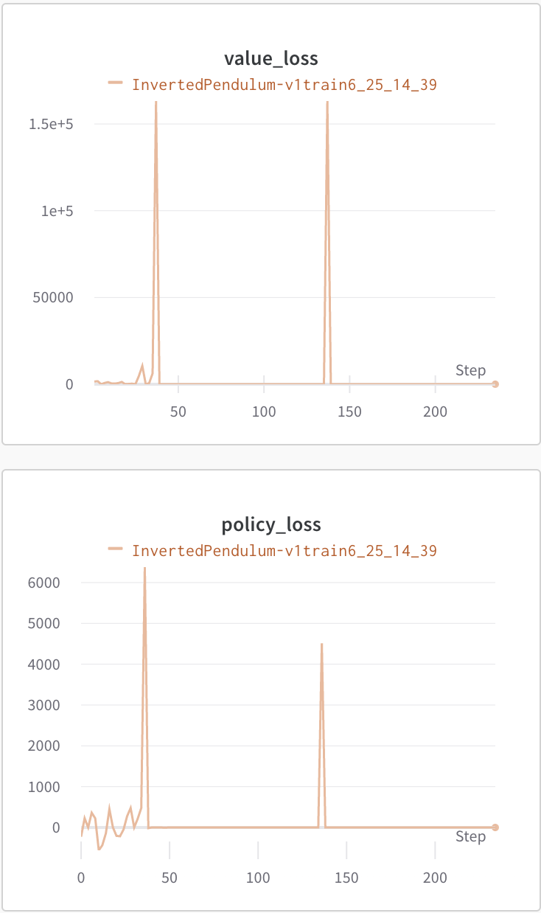
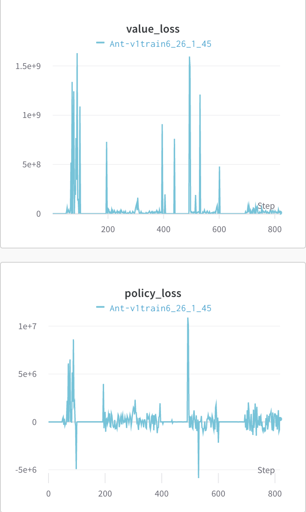

# a3c-mujoco-pytorch

1. 실행
```python
python main.py
```

2. config에서 hyper param 수정


---
## ⚪️ Report
- 사용한 Mujoco Environment: 
  - InvertedPendulum-v1
    
    - observation shape: (4[-inf~inf],)
    - action space: (1[-3~3],)

  - Swimmer-v4
    
    - observation shape: (8[-inf~inf],)
    - action space: (2[-1~1],)

  - Hopper-v1
    
    - observation shape: (11[-inf~inf],)
    - action space: (3[-1~1],)

  - Ant-v4
    
    - observation shape: (27[-inf~inf],)
    - action space: (8[-1~1],)

  - Humanoid-v1
    
    - observation shape: (376[-inf~inf],)
    - action space: (1[-0.4~0.4],)


- score
  - InvertedPendulum
    - reward
    
    - loss
    

  - Swimmer
    - reward
    
    - loss
    
  
  - Hopper
    - reward
    
    - loss
    

  - Ant
    - reward
    
    - loss
    
  
  - Humanoid
    - reward
    
    - loss
    

- 하이퍼파라미터
  ```
  > learning_rate = 1e-4
  > optimizer = Adam
  > gamma = 0.99
  > seed = 1004
  > 한 에피소드 = 20스텝
  > loss 계산 시 entropy에 0.0001 곱해서 계산
  > 20번 step 후 global update
  > agent 16개 이용
  
  ```
- network
  

- model input: 
  - 각 env 마다 주어지는 observation을 그대로 사용
  - InvertedPendulum: (4[-inf~inf],)
  - Swimmer: (8[-inf~inf],)
  - Hopper: (11[-inf~inf],)
  - Ant: (27[-inf~inf],)
  - Humanoid: (376[-inf~inf],)

- model output: 
  - value 
  - 각 env 마다 주어지는 action 개수 만큼의 mu, sigma
  - InvertedPendulum: (1[-3~3],)
  - Swimmer: (2[-1~1],)
  - Hopper: (3[-1~1],)
  - Ant: (8[-1~1],)
  - Humanoid: (1[-0.4~0.4],)

- action:
  - torch.distributions의 normal distribution 이용
  - model의 output인 mu와 sigma를 넣고 action space 개수 만큼 distribution 생성
  - 각 distribution에서 action 추출
  - 매 env step마다 action 추출

- 분석
  InvertedPendulum을 빼고 모든 실험이 학습이 안됐다.
  특히 Ant 같은 경우에는 점점 마이너스 리워드를 받는 모습을 볼 수 있었다. 이를 위해 reward를 -100 ~ 1000으로 스케일링도 해보았지만 학습이 되지 않았다.
  네트워크가 얇아서 복잡한 문제는 풀지 못했던 것도 있는 것 같다.

---

## ⚪️ ToDo

- [x] env: mujoco
- [x] model
- [x] simulate
- [x] test
- [x] train: 
  - [x] loss에 entropy항 추가해서 sigma 작게 나올 수 있게 함.
  - [x] train시 lock이 있을 필요가 없음. - mutex 쓰면 느려지고, 에이전트들도 가끔씩 업데이트 하기 때문에 겹칠일 없고 겹치더라도 크게 영향 주진 않음.
- [x] logging(wandb)
  - [ ] model 보여주기
  - [ ] cfg 보여주기
---

## ⚪️ 참고

- 멀티 프로세싱을 위해 참고

  - https://pytorch.org/docs/stable/notes/multiprocessing.html

- 참고 깃허브 

  - https://github.com/ikostrikov/pytorch-a3c.git

  - https://github.com/andrewliao11/pytorch-a3c-mujoco.git

  - https://github.com/MorvanZhou/pytorch-A3C.git
